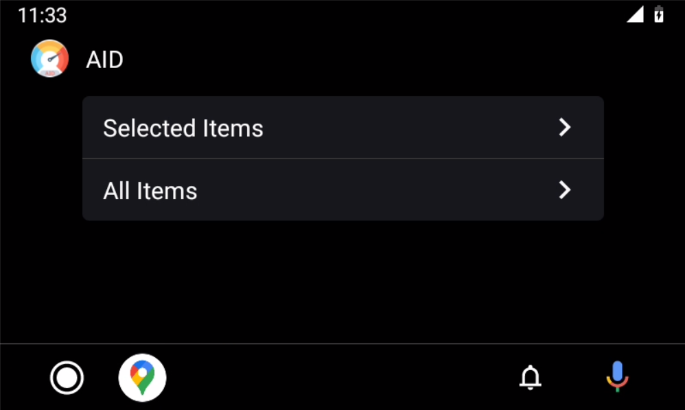
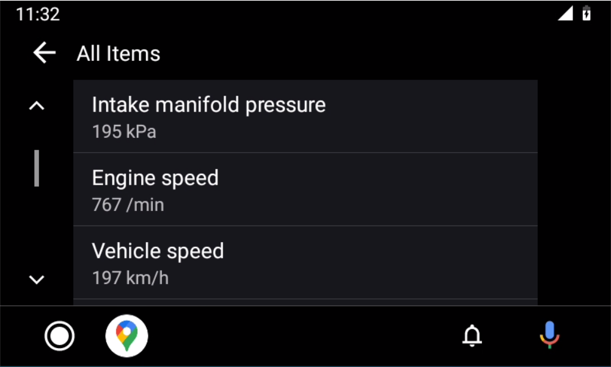

# AutoInsightsDashboard
This is an Android Application that uses Android Auto to project OBD2 data on a vehicle's screen.

# Instrunctions
Follow the link for full instructions on how to use the applicaiton.
[AID](https://aid.cs.ucy.ac.cy/)

# Video
[Youtube link](https://www.youtube.com/watch?v=ihxgydwkFgU)

# Further read
Thesis that describes the process used by this application and analyzed modern automotive systems.
[An OBD2 data monitoring platform](./AnOBDDataMonitoringPlatforminAndroidAuto.pdf)

# Android Auto Screens






# Clone
To download the source code:
```bash
git clone https://github.com/dmsl/aid --recursive-submodules
```
